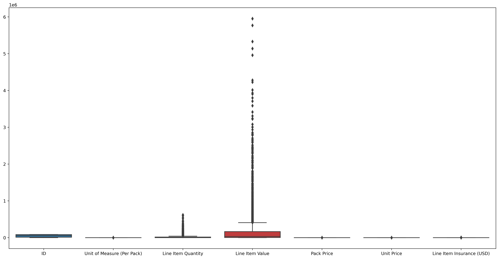
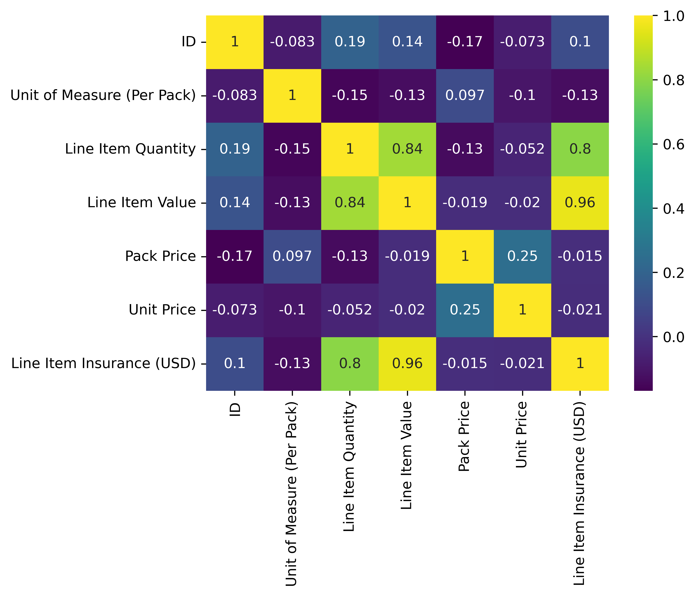
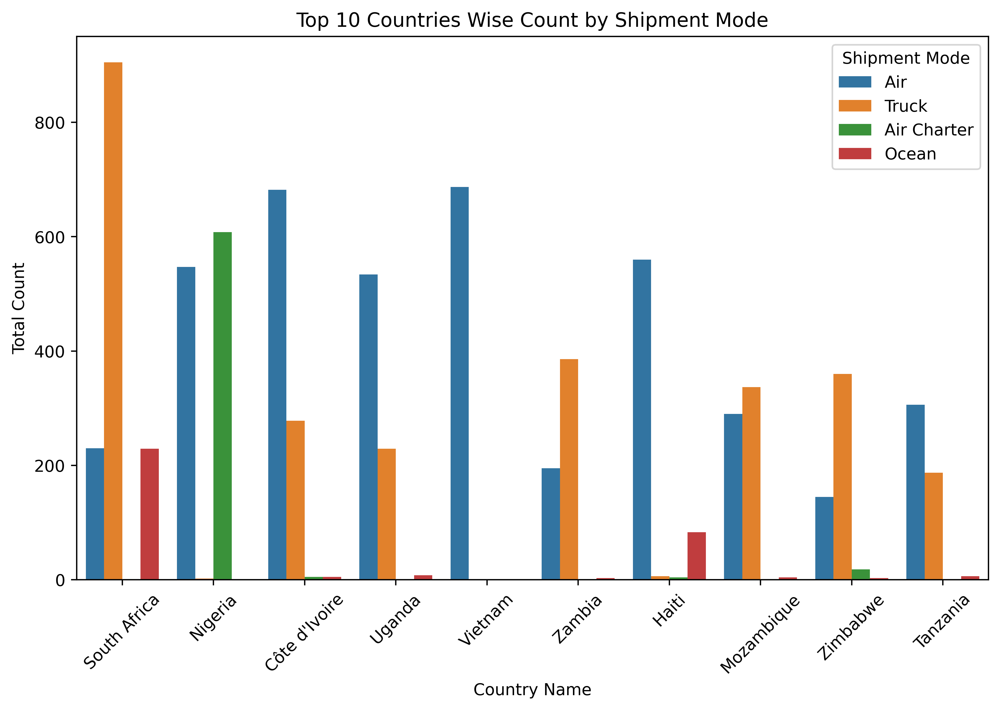
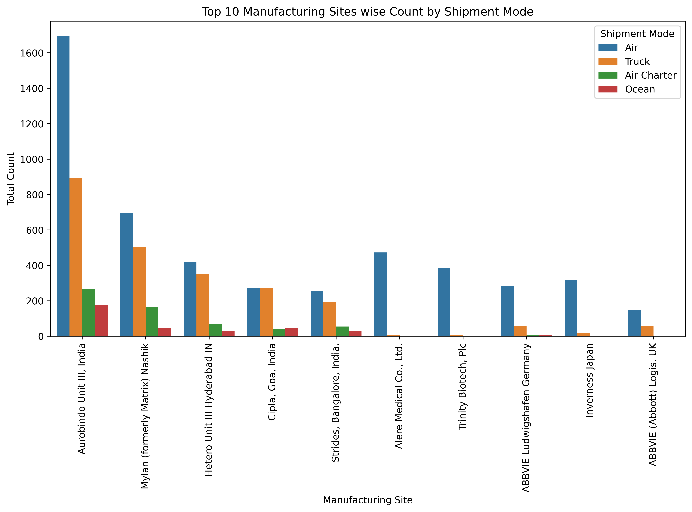
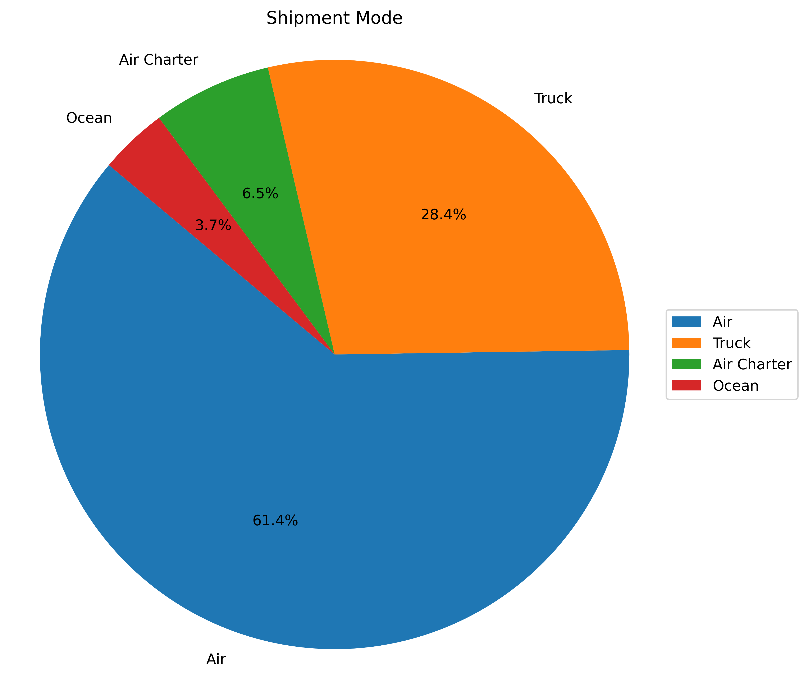
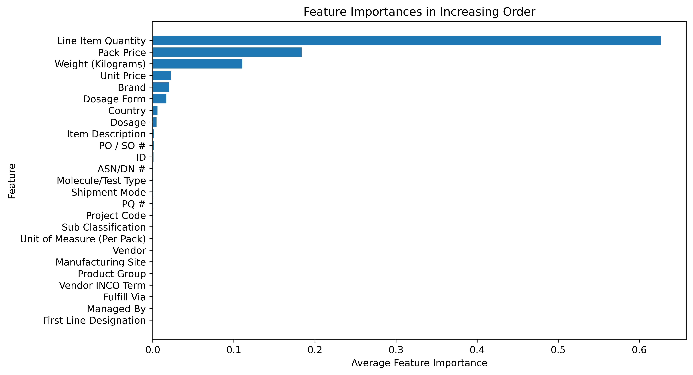
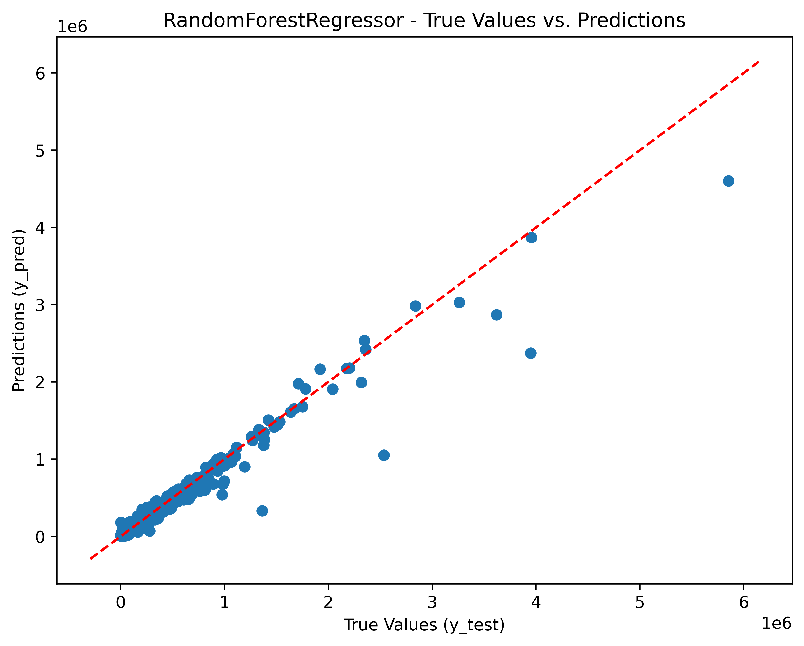
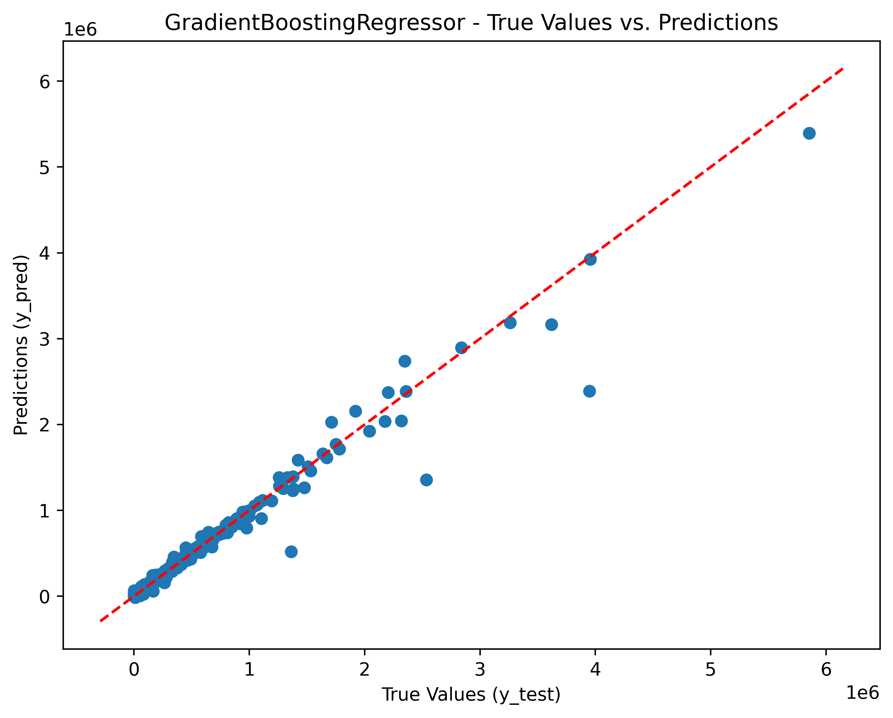
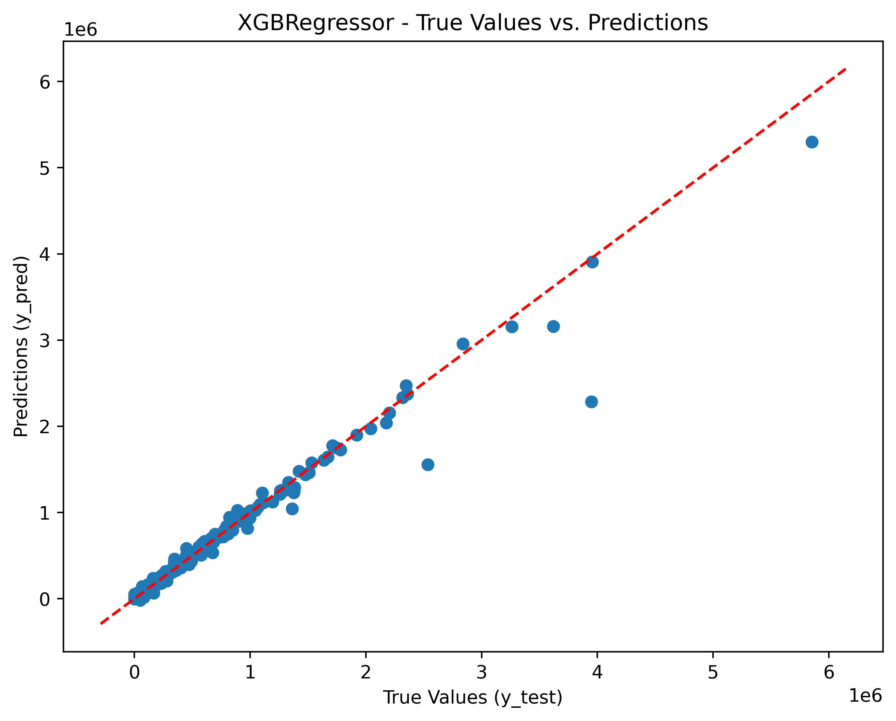
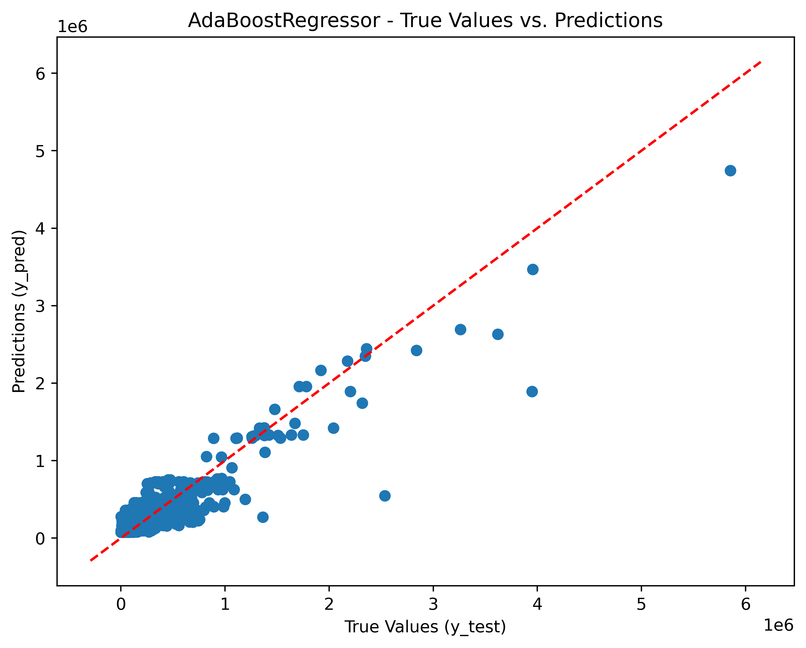

Chain Supply Shipment Price Prediction Project

Problem Statement:
The market for supply chain analytics is expected to develop at a CAGR of 17.3 percent from 2019 to 2024, more than doubling in size. This data demonstrates how supply chain organizations are understanding the advantages of being able to predict what will happen in the future with a decent degree of certainty. Supply chain leaders may use this data to address supply chain difficulties, cut costs, and enhance service levels all at the same time.
The main goal is to predict the supply chain shipment pricing based on the available factors in the dataset.

EDA:

---

Shape of Dataset:  (10324, 33)

Weight(Kilograms) and Freight Cost(USD) not having proper format

1. Shipment Mode columnn has missing entries 360
2. Dosage columnn has missing entries 1736
3. Line Item Insurance (USD) columnn has missing entries 287

Visualization:

---

